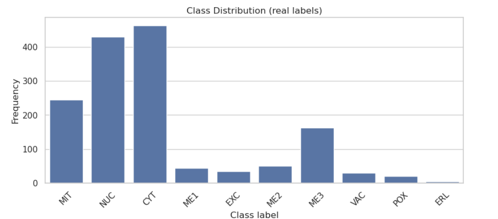
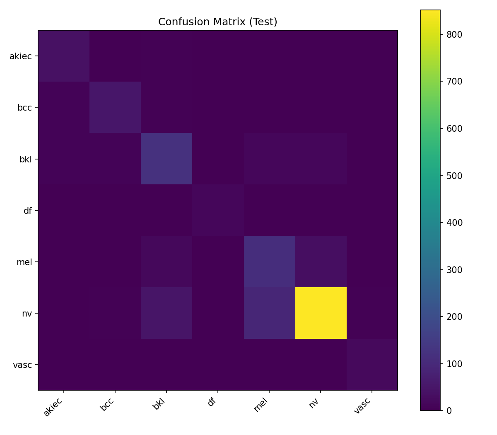
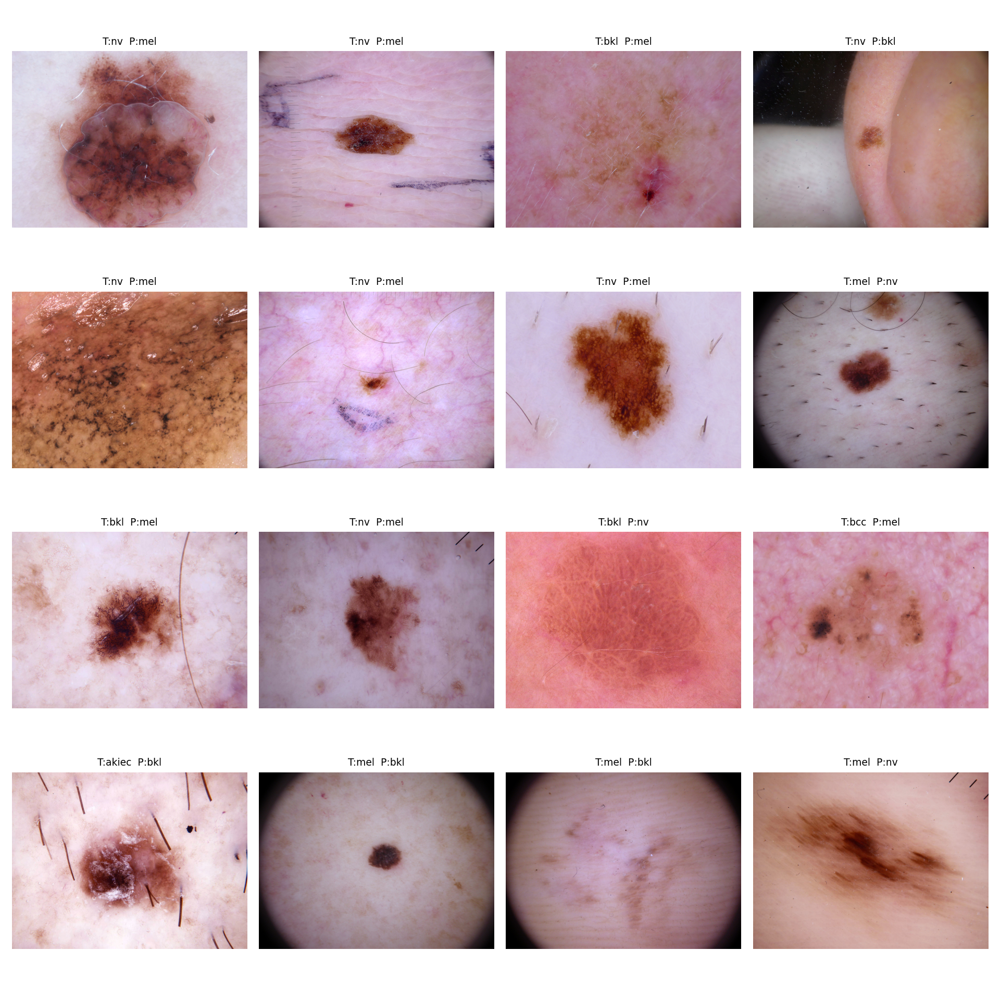
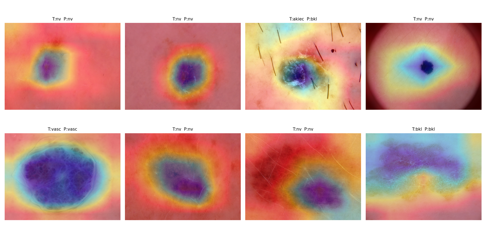

# AML Advanced Project — HAM10000 Skin Lesion Classification


This repository presents a multi-class skin lesion classification pipeline developed on the **HAM10000 (Skin Cancer MNIST)** dermatoscopic dataset.  
The project leverages a pretrained convolutional neural network and explicitly addresses severe class imbalance, with emphasis on robust evaluation, reproducibility, and qualitative error analysis.

Rather than optimizing for leaderboard performance, the focus is on building a reliable and interpretable experimental pipeline suitable for medical imaging tasks.

---

## Dataset

- **HAM10000** dermatoscopic image dataset  
- **10,015** RGB images  
- **7 diagnostic classes**: akiec, bcc, bkl, df, mel, nv, vasc  
- Highly imbalanced label distribution (melanocytic nevi dominate)

Class distribution:



---

## Methodology

- **Backbone**: EfficientNet-B0 (ImageNet pretrained)  
- **Input resolution**: 224 × 224  
- **Data augmentation**: strong geometric and photometric transformations  
- **Loss function**: Weighted Cross-Entropy  
- **Optimizer**: AdamW  
- **Learning rate schedule**: Cosine Annealing  
- **Mixed precision training**: enabled (AMP)  
- **Model selection criterion**: best checkpoint based on validation Macro-F1  

This configuration balances performance, stability, and computational efficiency.

---

## Evaluation Protocol

Due to the pronounced class imbalance, overall accuracy is not a reliable metric.

**Primary metrics**
- Macro-F1  
- Balanced Accuracy  

**Additional analyses**
- Confusion matrix  
- Qualitative inspection of misclassified samples  
- Gradient-weighted Class Activation Mapping (Grad-CAM)

---

## Results

| Metric | Value |
|------|------|
| Best Validation Macro-F1 | ~0.75 |
| Test Macro-F1 | ~0.74 |
| Test Balanced Accuracy | ~0.80 |

Confusion matrix on the held-out test set:



The close alignment between validation and test metrics indicates good generalization.

---

## Error Analysis

Most misclassifications arise between visually similar lesion types, in particular:
- melanocytic nevi ↔ melanoma  
- benign keratosis ↔ melanoma  

Representative misclassified samples:



These errors reflect intrinsic ambiguities in dermatoscopic patterns rather than random model failures.

---

## Model Explainability (Grad-CAM)

Grad-CAM was applied to visualize image regions contributing most strongly to model predictions.



The model consistently focuses on lesion cores and borders, aligning with clinically relevant diagnostic cues.

---

## Repository Structure

```text
ham10000-skin-lesion-classification/
├─ README.md
├─ requirements.txt
├─ .gitignore
├─ notebooks/
│  └─ HAM10000_Classification.ipynb
├─ data/
│  ├─ splits/
│  │  ├─ train.csv
│  │  ├─ val.csv
│  │  └─ test.csv
│  └─ metadata/
│     └─ HAM10000_metadata.csv
├─ results/
│  ├─ metrics.json
│  ├─ history.csv
│  └─ checkpoints/
│     └─ best_model.pt
├─ figures/
│  ├─ class_distribution.png
│  ├─ samples_grid.png
│  ├─ confusion_matrix.png
│  ├─ misclassifications_grid.png
│  └─ gradcam_examples.png
└─ LICENSE
```

---

## How to Run

This project is designed to be executed in **Google Colab**.

1. Open the notebook  
   `notebooks/HAM10000_Classification.ipynb`
2. Enable GPU support  
   `Runtime → Change runtime type → GPU`
3. Upload your `kaggle.json` file when prompted
4. Run all cells sequentially

All outputs (metrics, figures, logs, and checkpoints) are automatically saved
in the `results/` and `figures/` directories.

---

## Limitations and Future Work

- Severe class imbalance remains challenging despite weighted loss strategies
- No ensemble methods or multi-scale inference were explored
- Only image data were used; no clinical metadata were available

Possible future improvements include:
- Ensemble models
- Advanced imbalance-aware loss functions
- Integration of patient-level or clinical features

---

## Notes

This project was developed for educational purposes within the context of an
advanced machine learning course.  
The focus is on **reproducibility**, **clarity**, and **realistic evaluation**
rather than leaderboard-oriented optimization.

---

## License

This project is released under the **MIT License**.
